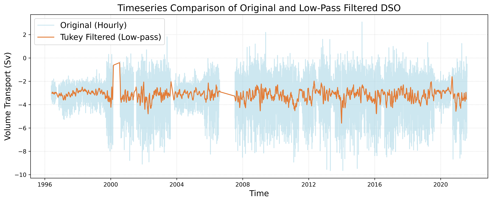
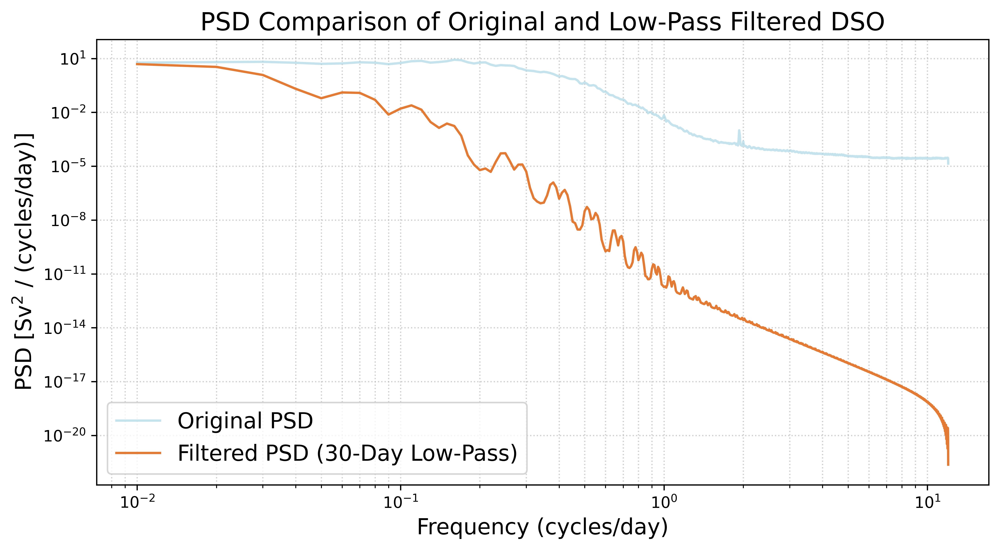
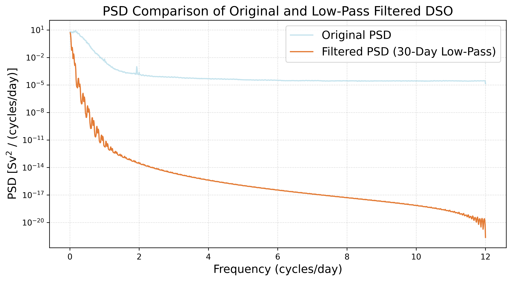
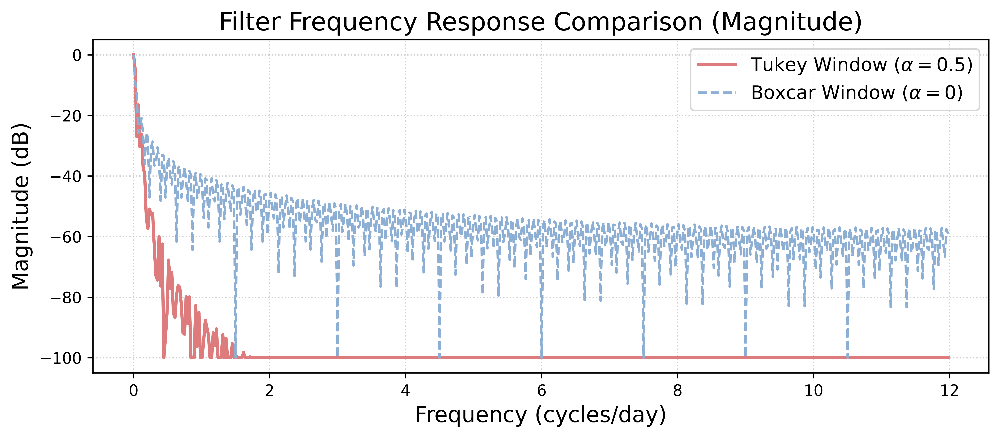
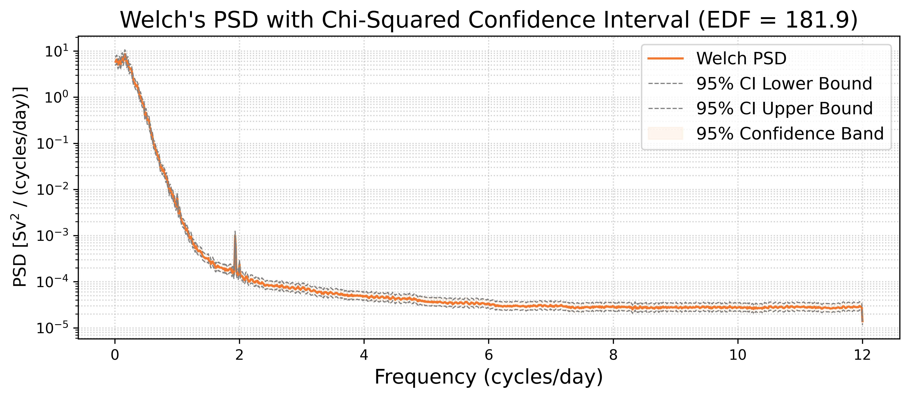
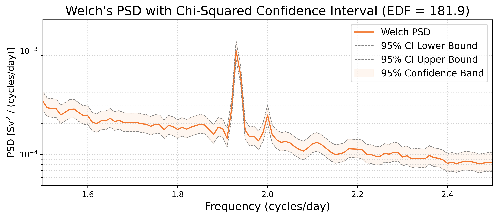

# Assignment 1 Report | Characterising an AMOC timeseries

- Author: Hengxi Yang

- Date: Sep 2026

- Course : 63-731 Data Analysis in Physical Oceanography

## 1. Introduction

### **1.1 Aim**

- Load the DSO transport timeseries and fill its NaN positions. Plot a Frequency distribution figure to illustrate the volume distribution.

- Compute and plot a power spectrum of DSO transport using Welch's overlapped-segment averaging. Furthermore, verify the variance budget with Parseval and apply a low-pass filter on the original timeseries, plot a timeseries and a power spectrum to compare the original one and the filtered one.

- Apply two different windows and see which one has a better ability to suppress the sidelobes. Add a chi-squared confidence band to the spectrum with EDF.

### **1.2 Data and Series**

- **Dataset**: Denmark Strait Overflow, DSO, hourly

- **Series**: Overflow time-series through Denmark Strait

- **Timespan**: 1996-05-01 to 2021-08-07

- **Record length**: 221,514

----

## 2. Results and Discussion

### **Part A Characterise the Series**

The series I chose is Denmark Strait Overflow (DSO). I tried Calafat 2025 before, which includes a meridional heat transport timeseries with a sample size of only 66, it was too small for the following processing. I also tried OSNAP west, which also has a small sample size. Admittedly, DSO is the lower limb of the AMOC rather than direct overturning transport, but it is a core component of the AMOC. Futhermore, options are limited, and the DSO transport timeseries has a long timespan with 221,514 data points, making it an optimal choice.

Here is some info on trans_DSO:

| Parameter| Value |
| :--- | :--- |
| **Record Length** | 221,514 time steps |
| **Timespan** | 1996-05-01 to 2021-08-07 |
| **Sampling Interval** | ~ 1 hour |
| **Missing Values** | 18,456 |

Because there're a lot pf NaNs, I can't just drop them. So I used `linear interpolation` to fill the NaN positions. I didn't know if there's any pattern or period in Trans_DSO, so linear interpolation is the safest way. For the remaining NaNs at both ends, I dropped them directly. Here is some info on the new Tran_DSO.

| Parameter | Value |
| :--- | :--- |
| **Record Length** | 220,956 time steps |
| **Timespan** | 1996-05-24 to 2021-08-07 |
| **Sampling Interval** | ~ 1 hour |
| **Missing Values** | 0 |

The timespan shortened, but it was worth it.

| Parameter | Value (Sv) |
| :--- | :--- |
| **Mean** | -3.125 |
| **Standard Deviation** | 1.457 |
| **Minimum** | -9.661 |
| **Maximum** | 3.084 |
| **Range** | 12.745 |

$\text{Bin width} = \frac{12.745\text{ Sv}}{100} = \mathbf{0.12745\text{ Sv}}$

According to the distribution figure, the southward transport concentrates around the mean, which indicates that the DSO might have some specific flow characteristics. The standard deviation $\sigma = 1.46 Sv$ indicates that the transport timeseries has significant fluctuations.

---

### **Part B The Spectrum**

| Parameter | Value |
| :--- | :--- |
| `segment length` |  100-day seasonal window |
| `noverlap` | 50% (default)|
| `sample frequency` | 24 |
| `Nyquist freqency` | 12 cycles/day |

The PSD figure shows that most of power concentrates around the **low frequence area** . There's a steep decrease from $10^{-1}$ to ${10^0} $ cycles/day, which means the power of DSO distributes in seasonal and longer time scales.

Addtionally, there's a significant peak around 2 cycles/day, which can be seen clearly in the semi-log figure:

Denmark Strait is situated between Greenland and Iceland, where semidiurnal tides (such as the M2) dominate. The period of M2 is about half of a day, so most of the energy is focused around 2 cycles/day.

The red noise spans from $10^{-2}$ to ${10^0} cycles/day, the low frequency range reveals long-term signal, while in the later area, the higher the frequency, the lower the PSD.

The white noise starts from ~ 4 cycles/day, where the PSD keeps nearly constant across frequencies, indicating that the real oceanographic signals have decayed.

The Parseval's Theorem is:

$$\text{Variance}_{\text{time}} \approx \sum \text{PSD} \times \Delta f$$

The verification results:

| Parameter | Value |
| :--- | :--- |
| **Time-domain Variance** | $2.122\text{ Sv}^2$ |
| **Frequency-domain Integral (PSD)** | $1.931\text{ Sv}^2$ |
| **Difference** | $0.191\text{ Sv}^2$ |
| **Relative Error** | $8.992\%$ |
| **Tolerance** | $10\%$ |
| **Test Result** | Passed |

The relative error is 8.992%, clearly passes the 10% threshold.

After applying 30-day Tukey low-pass window, the amplitude of Trans_SDO narrows considerably.

Due to the data gaps around 2000 and 2007, the Tukey Filter cannot smooth the signals properly.

The 30-day low-pass filter removed a lot rapid and strong fluctuations. 

From $10^{-1}$ to $10^1$ cycles/day, the filtered PSD shows periodic ripples. Overall, the filtered PSD has a bigger slope relative to the original one. As high-frequency signal (white noise) are removed, the power of the filtered one is significantly lower than the original one starting from around 2 cycles/day (high-frequency area), which can be seen clearly in the semilog figure:

---

### **Part C Filter Design and Spectral Confidence Interval**

I applied two different windows on the DSO transport series, one is Tukey, and another one is a pure box without any edge smoothing, both are 30-day low-pass filters. I computed the frequency responses after normalization, here is the result.

Without any tapering, the boxcar window exhibits periodic sidelobes, leaving more high-frequency energy at the same time. In contrast, the Tukey window shows a better ability to attenuate the high-frequency signals.

The following figure illustrates the Welch's PSD with Chi-squared Confidence interval.

If we zoom in and foucs on the salient peak:

The peak lies within the 95% confidence band, but it rises sharply above the background noise, making it a highly significant tidal signal.

